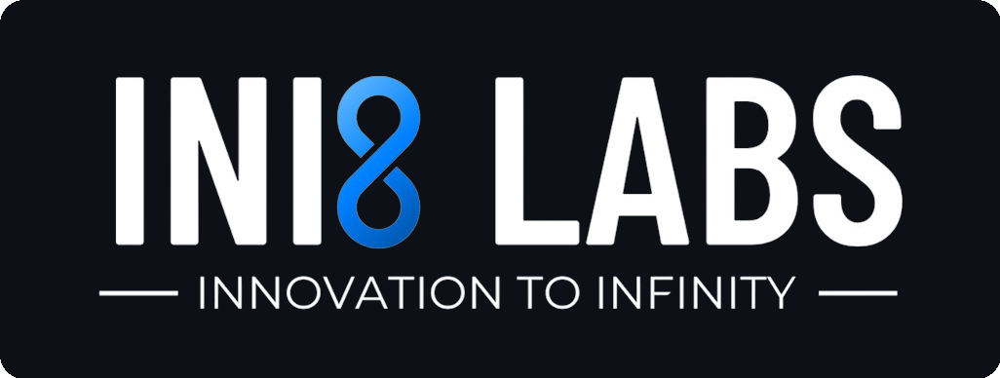

  

**We help businesses design, build, and scale intelligent systems — from machine learning pipelines to production-grade cloud infrastructure.**

 

&nbsp;&nbsp;
&nbsp;&nbsp;

 

<h2 align="center">What We Do</h2>

<table>
<tr>
<td width="55%" valign="top">

### AI & Machine Learning Engineering

From custom model development and LLM integration to production-ready data pipelines — we design and deploy end-to-end ML systems that solve real business problems.

`Model Training` `Fine-tuning` `Inference Optimization` `Workflow Integration`

</td>
<td width="45%" align="center" valign="middle">

</td>
</tr>
</table>

<table>
<tr>
<td width="45%" align="center" valign="middle">

</td>
<td width="55%" valign="top">

### Cloud Infrastructure & DevOps

We architect and manage cloud-native environments across AWS, GCP, and Azure — building resilient, cost-efficient systems that scale with your business.

`Kubernetes` `Infrastructure-as-Code` `CI/CD` `Multi-Cloud`

</td>
</tr>
</table>

<table>
<tr>
<td width="55%" valign="top">

### Data Engineering & Analytics

We build the data foundations that power intelligent decision-making — from ingestion pipelines and transformation layers to warehousing and real-time analytics.

`Data Pipelines` `Warehousing` `Real-time Analytics` `Data Strategy`

</td>
<td width="45%" align="center" valign="middle">

</td>
</tr>
</table>

<table>
<tr>
<td valign="top">

### Product Engineering

Full-stack application development from backend APIs and distributed services to polished frontend experiences. We take products from concept to production with a focus on performance, reliability, and maintainable architecture.

`Backend APIs` `Distributed Services` `Frontend` `Mobile`

</td>
</tr>
</table>

---

**INI8 Labs** &nbsp;&middot;&nbsp; India

